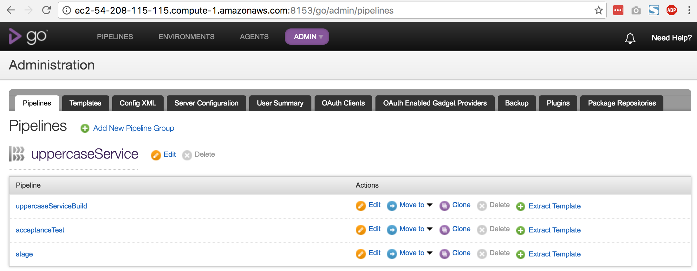
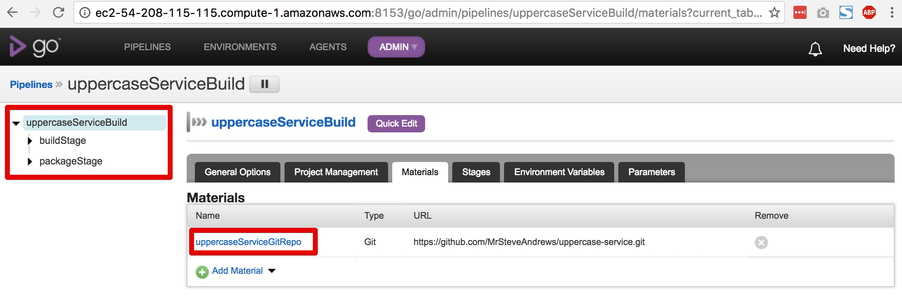
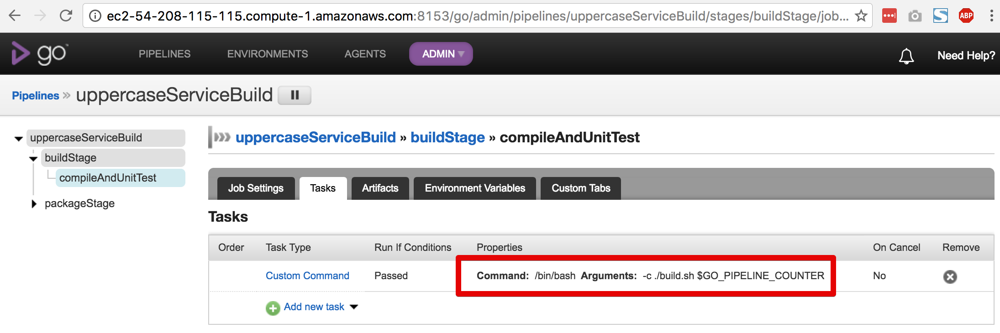
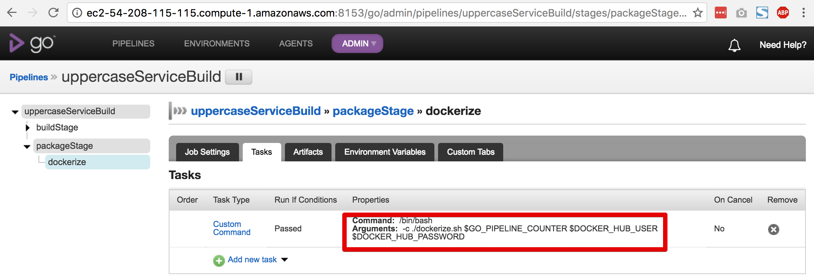

#Demonstrating BlueCDP
BlueCDP can be used to demonstrate various DevOps concepts with concrete examples.  

## Open the CDP Dashboard
The latest status of all of the configured pipeline groups may be viewed on the GoCD landing page.  We'll be working with the `uppercaseService` pipeline group for this demo.

The dashboard shows that all the jobs in all the stages in all the pipelines for the `uppercaseService` pipeline group have passed (that's why they are green).  

## View the Pipeline Configuration
Let's look at the configuration for the `uppercaseService` pipeline group.  Select `Admin->Pipelines` from the main menu bar.

### Build Pipeline Configuration
The `uppercaseServiceBuild` pipeline has two stages, which run sequentially whenever there is a commit to the `uppercase-service` git repo.

#### Build Stage
When the `buildStage` runs, it compiles the `uppercase-server` code and runs the unit tests.

To do this the stage has a job that executes a script called `build.sh` on the agent instance.  The `GO_PIPELINE_COUNTER` variable is passed into the script.  `GO_PIPELINE_COUNTER` is incremented each time GoCD runs a pipeline.  This method ensures that every build of uppercase-service has a unique sequential version number. 

This has historically been a problem with Maven builds, which require the version number to be hard-coded in the pom.xml file. Now the Maven Versions plugin can be used to dynamically set the build artifact version number.

`build.sh`:

~~~bash
#!/bin/sh

#Set the version number.  The CD process will set this to the pipeline count.
mvn versions:set -DnewVersion=$1
mvn clean install
mvn versions:revert
~~~

The output of build.sh is a Java archive named uppercase-service-{version}.jar.

#### Package Stage
If the build stage completes with no errors, then the resulting JAR file is packaged into a Docker image, which is then uploaded to DockerHub.

To do this, the stage has a job that executes a script called `dockerize.sh` on the agent instance.  `GO_PIPELINE_COUNTER` is passed into this script as well so that the Docker image can be tagged with the unique sequential version number. In addition, the DockerHub credentials are passed in so that the image can be uploaded to the Blue Agility DockerHub repository.  The image is also tagged with the label `at`, which tells the uppercaseAcceptanceTest pipeline that this is the image version to deploy and run tests against.

`dockerize.sh`:

~~~bash
#!/bin/sh

# Build and tag the image using the Dockerfile.  Pass in a tag as a parameter.  
# The CD server will pass in the pipeline count.

docker build -t blueagility/uppercase-service:$1 .
docker tag -f blueagility/uppercase-service:$1 blueagility/uppercase-service:at

# Push the image to DockerHub
docker login -u $2 -p $3
docker push blueagility/uppercase-service:$1
docker push blueagility/uppercase-service:at
~~~

`Dockerfile`:

~~~docker
FROM frolvlad/alpine-oraclejdk8:slim

VOLUME /tmp
ADD target/uppercase-service.jar uppercase-service.jar
ENTRYPOINT ["java", "-jar", "uppercase-service.jar"]
~~~

