#Operating BlueCDP
BlueCDP has several moving parts, each of which must be understood in order for it to be properly demonstrated.  

## Sample Application Code Base
BlueCDP is demonstrated by means of building and testing a simple microservice and web application.  The application under development is intentionally *very* simple so as not to distract the audience from the intent of the demo, which is how the application is built, deployed, and tested.

The Uppercase application consist of two runtime components:

* **uppercase-service**	 : A microservice that converts an input string of characters to upper case using the REST protocol
* **uppercase-web** : A web application that provides a simple user interface for interacting with uppercase-service

The code for these components is managed in GitHub in the following repositories:

* [uppercase-service](https://github.com/MrSteveAndrews/uppercase-service) : The uppercase-service application code
* [uppercase-service-at](https://github.com/MrSteveAndrews/uppercase-service-at) : The uppercase-service acceptance tests
* [uppercase-web](https://github.com/MrSteveAndrews/uppercase-web) :  The uppercase-web application code
* [uppercase-web-at](https://github.com/MrSteveAndrews/uppercase-web-at) : The uppercase-web acceptance tests

### Application Code
The application code is written in Java using the [Spring](https://spring.io/) framework and built with [Maven](https://maven.apache.org/).  Both the service and web components are run as [Spring Boot](https://projects.spring.io/spring-boot/) applications.

Once compiled, the uppercase-service and uppercase-web components are packaged into [Docker](https://www.docker.com/) images, which allows them to be deployed and run on any host that has the Docker runtime installed.

### Acceptance Tests
The uppercase-service and uppercase-web acceptance test specifications are defined using [Gherkin](https://cucumber.io/docs/reference#gherkin) and made executable using [Cucumber-JVM](https://cucumber.io/docs/reference/jvm).  uppercase-web acceptance test steps use [Selenium WebDriver](http://www.seleniumhq.org/projects/webdriver/) with the [PageObject](https://github.com/SeleniumHQ/selenium/wiki/PageObjects) pattern.  

If you want to understand the expected behavior of uppercase-service, simply refer to the uppercase-service-at feature files. For example:

~~~gherkin
Feature: Transform string values to upper case using the REST service API

  Scenario: Transform lower case strings to upper case
    Given the upper case service is running
    When the input string "abc" is passed into the upper case service
    Then the resulting output string is "ABC"
  Scenario: Transform upper case strings to upper case
    Given the upper case service is running
    When the input string "GHI" is passed into the upper case service
    Then the resulting output string is "GHI"
~~~

## Cloud Computing Environment
All of the BlueCDP components are deployed to [AWS EC2](https://aws.amazon.com/ec2/) virtual instances under the Blue Agility AWS account.  

### Security
The Blue Agility AWS account may be accessed at [https://blueagility.signin.aws.amazon.com/console](https://blueagility.signin.aws.amazon.com/console).  The login credentials may be found [here](https://intranet.blue-agility.com/bluejazz/wiki/bluecdp/).

All of the BlueCDP computing resources are secured with the **devops** key pair: 

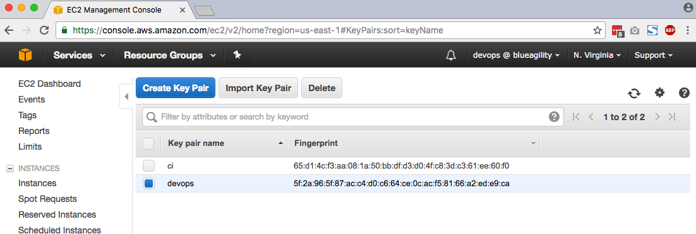

In order to SSH to any EC2 instance secured with this key pair, you must have the associated private key on your local host.  Instructions for creating the private key file are located [here](https://intranet.blue-agility.com/bluejazz/wiki/bluecdp/).

### Networking
All BlueCDP computing resources are accessible over the public Internet via the public subnet of the devops_vpc virtual private cloud ([VPC](https://aws.amazon.com/vpc)).  The purpose for this is to attain a level of network isolation between BlueCDP and other Blue Agility computing resources.

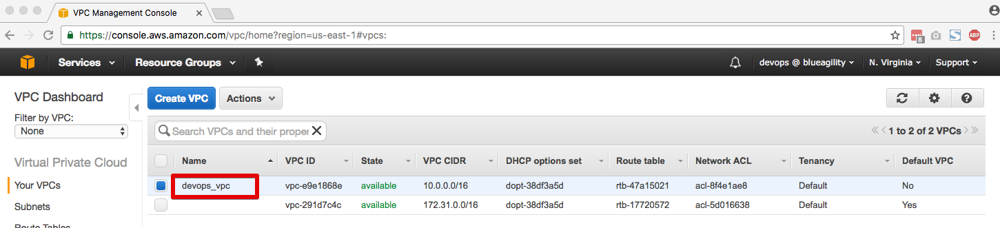

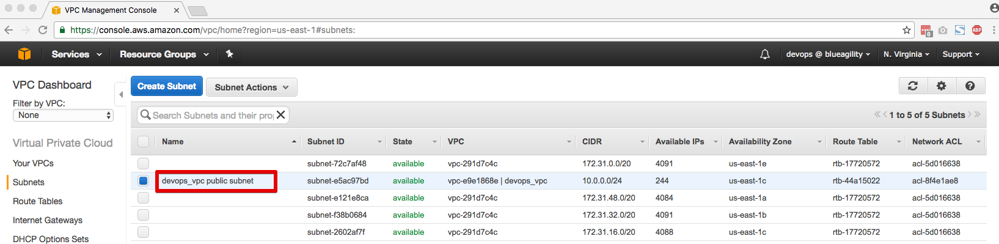

### EC2

BlueCDP EC2 instances may be managed and monitored from the EC2 console.  Note that you can filter the list to only show those instances with key pair = **devops**

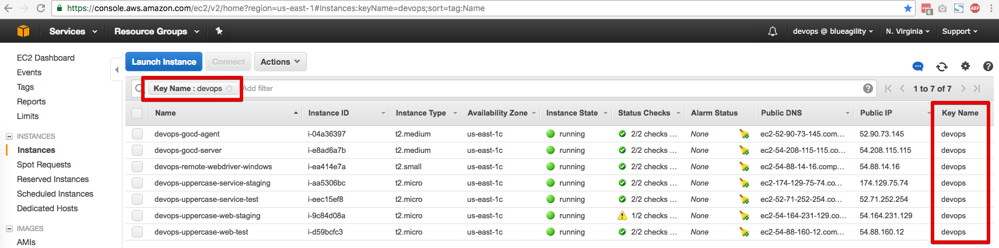

#### Continuous Delivery Pipeline
BlueCDP uses [ThoughtWorks Go CD](https://www.go.cd/) to orchestrate the steps in the build, deploy, test value stream.  GoCD is free and open source and does a great job of visualizing the value stream.

GoCD leverages a distributed architecture wherein a central *server* orchestrates the activities of *agents* that perform the work in the various pipeline jobs.

The Go Server and a single Go Agent are running on the **devops-gocd-server** and **devops-gocd-agent** EC2 instances respectively.

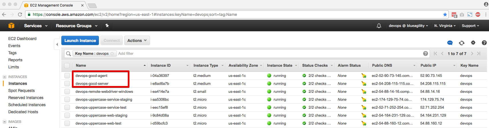

##### Server

The GoCD server runs in a Docker container on an EC2 instance.  GoCD server provides access to the web app on non-secure and secure ports 8143 and 8154 respectively so these inbound ports must be made accessible via the instance's security group configuration:

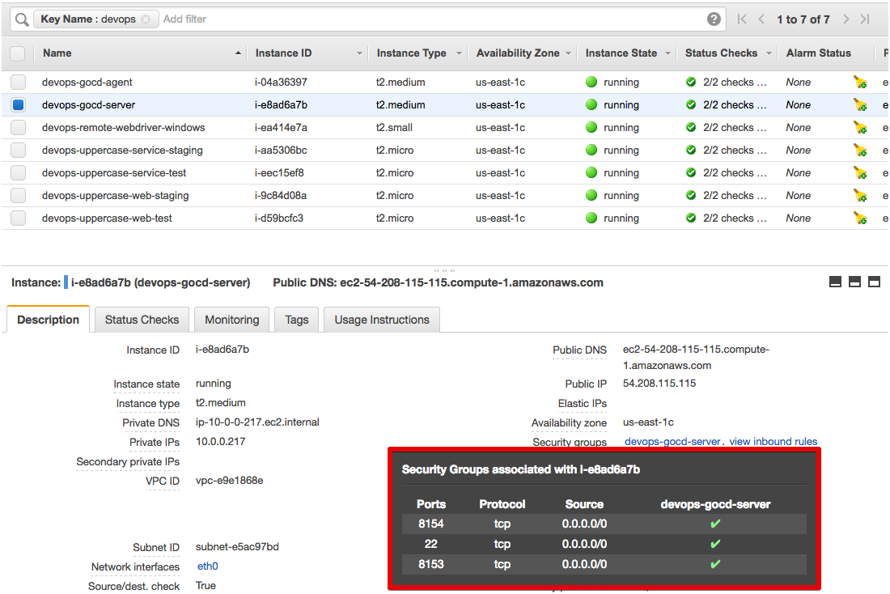
To start the GoCD server, SSH to the instance

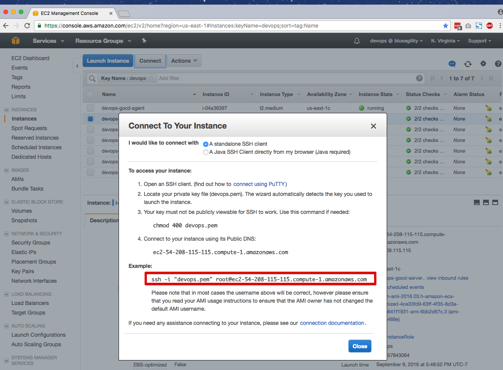

Execute the following command to run the gocd-server as a background process and expose the Docker container ports to the same host ports:

~~~bash
docker start -d -P 8153:8153 -P 8154:8154 gocd/gocd-server
~~~

Check to make sure the process is running:

~~~bash
docker ps
~~~

Should display something like:

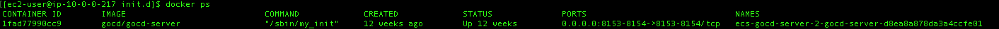

You should now be able to access the GoCD server web app via the instance public DNS

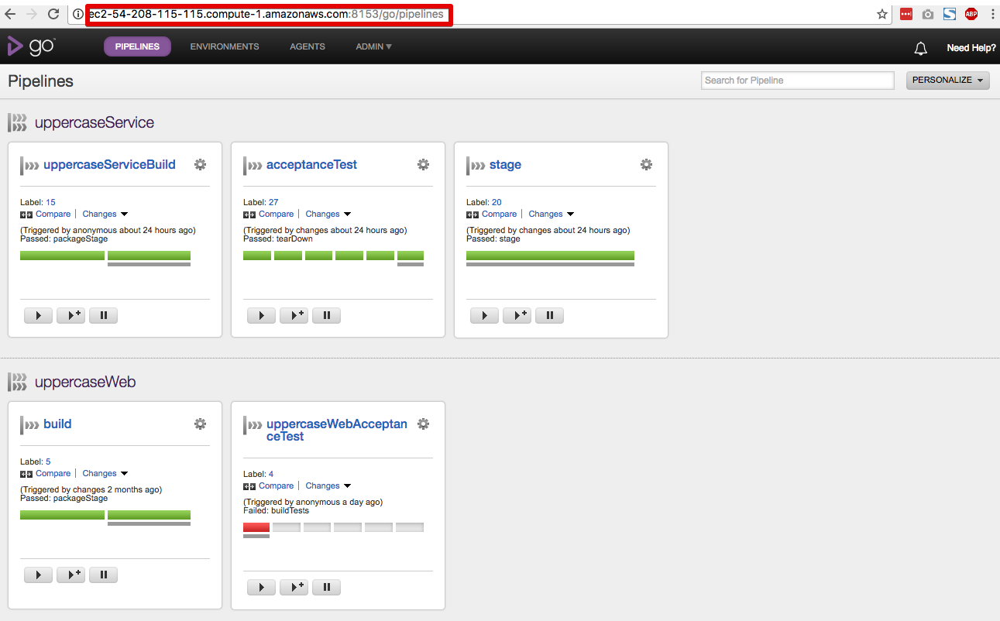

##### Agents

Agents must be provisioned with all of the software necessary to perform assigned tasks.  For example, our agent needs to be able to:

1. Pull the latest changes - **git**
2. Build the component - **Java** and **Maven**
3. Package the component for distribution - **Docker**

To create new GoCD agents with this instance configuration, you can use the **gocd-agent-git-java8-maven** Amazon Machine Image (AMI)

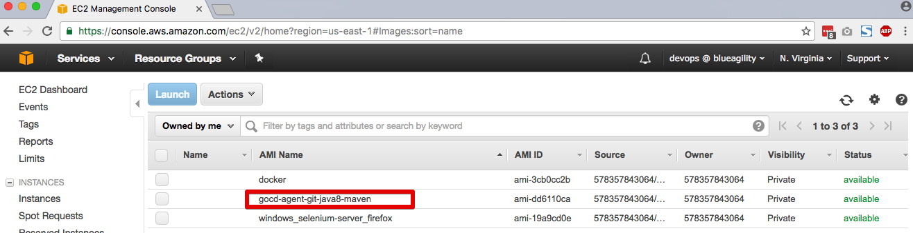

Note that you will SSH to the agent instance using the its public DNS address and the aforementioned **devops** private key

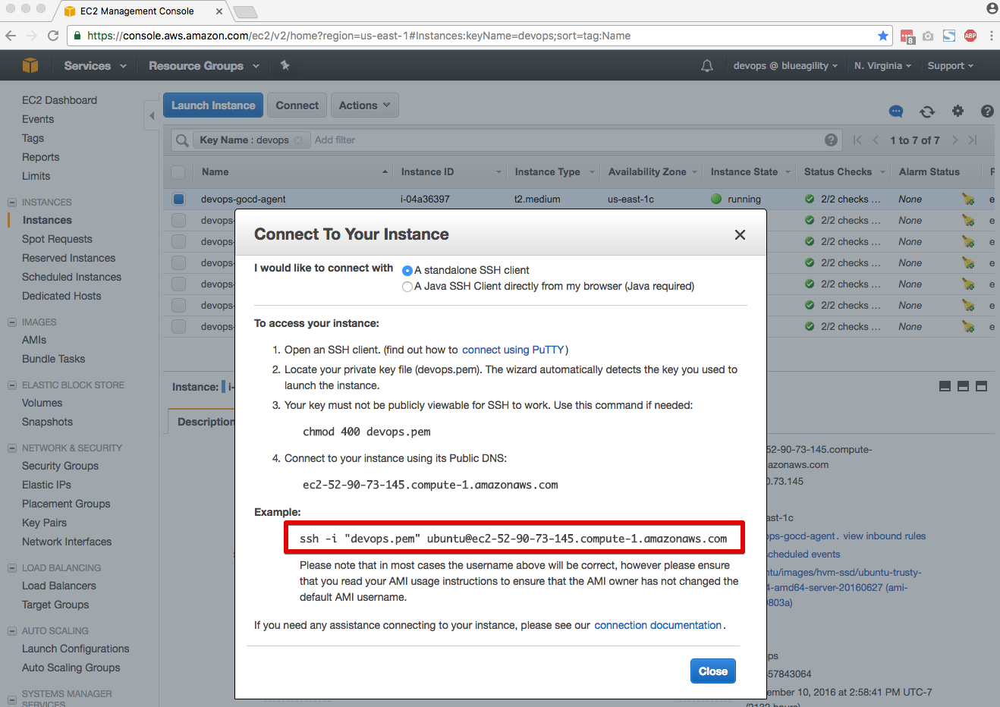

When GoCD agents are started, they connect to a specified GoCD server.  This is ocnfigured in the /etc/default/go-agent file on the agent instance like so:

~~~bash
GO_SERVER_URL=https://ec2-54-208-115-115.compute-1.amazonaws.com:8154/go
AGENT_WORK_DIR=/var/lib/${SERVICE_NAME:-go-agent}
DAEMON=Y
VNC=N
~~~

Once the agent is configured you can start the GoCD agent. SSH to the host and execute:

~~~bash
sudo /etc/init.d/go-agent start
~~~

When the agent is started, you can view it on the GoCD Agents page.  At this point, the agent may be configured to run specific pipeline jobs.

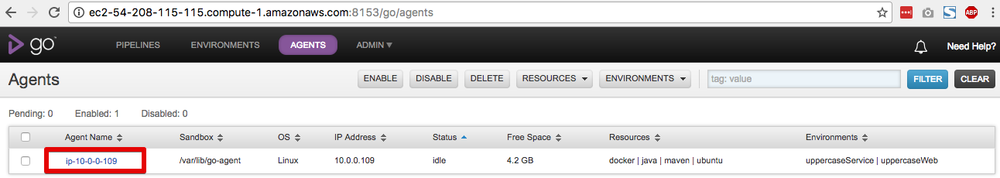

